# The Nook


The Nook is a full-stack e-commerce application designed to help readers discover and purchase books from independent authors.

Readers can browse and search a curated catalogue, view detailed book and author information, add books to their basket, complete purchases securely and leave reviews. Registered authors can create an author profile and submit their books for consideration, while staff members review listings before they become available in the public catalogue.

The submitted application is designed as a controlled bookshop rather than an unrestricted multi-vendor marketplace. The Nook manages the catalogue and sales process while giving independent authors a platform through which they can showcase their work. This approval process helps maintain a consistent standard across the catalogue and gives readers confidence in the books being offered.

The application is built using Django. It includes authentication, role-based author and staff functionality, user-owned account information, catalogue management and Stripe payment processing.

---

## Live Site

- Live site: [The Nook Heroku App](https://project-5-the-nook-bookshop-26884e3af76e.herokuapp.com)
- Repository: [The Nook GitHub Repository](https://github.com/gibba42/project_5_the_nook)

---

## Table of Contents

- [Technologies Used](#technologies-used)
- [Project Purpose](#project-purpose)
- [Target Audience](#target-audience)
  - [Readers](#readers)
  - [Independent Authors](#independent-authors)
  - [Site Administrators](#site-administrators)
- [E-commerce Business Model](#e-commerce-business-model)
  - [Value Proposition](#value-proposition)
  - [Revenue Model](#revenue-model)
  - [Operating Model](#operating-model)
- [Target Market](#target-market)
  - [Brand Positioning](#brand-positioning)
  - [Search Engine Optimisation](#search-engine-optimisation)
  - [Email Marketing](#email-marketing)
  - [Social Media](#social-media)
  - [Facebook Business Page](#facebook-business-page
  )
  - [Author-Led Promotion](#author-led-promotion)
  - [Customer Retention](#customer-retention)
  - [Future Marketing Opportunities](#future-marketing-opportunities)
- [Data Model](#data-model)
  - [Entity Relationship Diagram](#entity-relationship-diagram)
  - [Data Model Overview](#data-model-overview)
  - [Model Relationships](#model-relationships)
  - [User](#user)
  - [UserProfile](#userprofile)
  - [AuthorProfile](#authorprofile)
  - [Genre](#genre)
  - [Book](#book)
  - [Review](#review)
  - [Order](#order)
  - [OrderLineItem](#orderlineitem)
  - [NewsletterSubscriber](#newslettersubscriber)
  - [Data Integrity](#data-integrity)
- [Deployment](#deployment)
  - [Local Preparation](#local-preparation)
  - [Database Configuration](#database-configuration)
  - [Security and Environment Variables](#security-and-environment-variables)
  - [Heroku Deployment](#heroku-deployment)
  - [Production Database Setup](#production-database-setup)
  - [Cloudinary](#cloudinary)
  - [Stripe Configuration](#stripe-configuration)
  - [Django Sites and SEO](#django-sites-and-seo)
  - [Mailchimp](#mailchimp)
  - [Production Testing](#production-testing)
- [Security](#security)
- [UX Design](#ux-design)
  - [UI Design](#ui-design)
  - [UX Strategy](#ux-strategy)
  - [User Needs](#user-needs)
  - [Primary User Journeys](#primary-user-journeys)
  - [Information Architecture](#information-architecture)
  - [Wireframes and High-Fidelity Mock-ups](#wireframes-and-high-fidelity-mock-ups)
  - [Visual Design](#visual-design)
  - [Typography](#typography)
  - [Responsive Design](#responsive-design)
- [Agile Development](#agile-development)
  - [Github Project](#github-project)
  - [Epics](#epics)
  - [User Stories](#user-stories)
  - [MoSCoW Prioritisation](#moscow-prioritisation)
  - [Development Process](#development-process)
- [Testing](#testing)
  - [Manual Testing](#manual-testing)
  - [Automated Testing](#automated-testing)
  - [Testing During Development](#testing-during-development)
- [Validation](#validation)
  - [W3C HTML Validation Results](#w3c-html-validation-results)
  - [W3C Jigsaw Validation Results](#w3c-jigsaw-validation-results)
  - [Pycodestyle Results](#pycodestyle-results)
  - [JSHint Results](#jshint-results)
  - [Responsiveness Tests](#responsiveness-tests)
- [Bugs](#bugs)
- [Tutorials and Guides Used](#tutorials-and-guides-used)
  - [Django](#django)

---

## Technologies Used

- **HTML5** – used to structure the application’s pages and content.
- **CSS3** – used for the custom styling, responsive layouts and watercolour-inspired visual design.
- **JavaScript** – used to provide interactive behaviour, including the checkout process.
- **Python** – used for the application’s back-end logic.
- **Django 5.2.16** – used as the main web application framework.
- **SQLite** – used as the relational database during local development.
- **Bootstrap 5** – used to support responsive layouts and reusable interface components.
- **jQuery** – used for interface behaviour and displaying Django toast messages.
- **Django Allauth** – used for account registration, login, logout and authentication.
- **Django Crispy Forms** and **Crispy Bootstrap 5** – used to render and style application forms.
- **Stripe** – used to process payments securely.
- **Django Countries** – used to provide country choices within checkout and delivery forms.
- **Pillow** – used to support image uploads and processing for book covers and author profiles.
- **Font Awesome** – used to provide icons throughout the application.
- **Google Fonts** – used to provide the Libre Baskerville and DM Sans typefaces.
- **Git** – used for version control.
- **GitHub** – used to store the repository and manage the project through epics, user stories and tasks.
- **Figma** – used to plan the application’s page layouts and responsive design.
- **Visual Studio Code** – used as the main development environment.
- **ChatGPT** – used to support debugging, particularly updating the project to the latest versions of Django and Bootstrap. It was also used to generate fake book listing data. All generated suggestions were reviewed, adapted and tested before being included in the project.
- **Heroku** - used to host the live deployment of the project.
- **PostgreSQL** – used as the relational database for the deployed application.
- **Heroku Postgres** – used to provide the production PostgreSQL database.
- **Gunicorn** – used as the production WSGI server on Heroku.
- **WhiteNoise** – used to serve static files in production.
- **Cloudinary** – used to store uploaded media such as book covers.
- **Mailchimp** – used to manage newsletter subscriptions.

---

## Project Purpose

Independent authors can struggle to gain visibility through traditional booksellers, while readers may find it difficult to discover new books outside established publishing channels. The Nook is designed to bring these two groups together through an accessible online bookshop.

The application allows readers to discover independent books, learn more about their authors, make secure purchases and share their opinions through reviews. Authors can create a public profile and submit book listings, giving them a dedicated space to present their work to potential readers.

Unlike an unrestricted marketplace, every submitted book must be approved by a staff member before it appears in the public catalogue. This controlled approach allows The Nook to maintain the quality and consistency of its listings while providing readers with a more trustworthy shopping experience.

The project therefore has three main goals:

- Help readers discover and purchase books from independent authors.
- Give independent authors a structured way to showcase their work.
- Provide the site owner with a manageable e-commerce model through which listings, customers and purchases can be administered.

---

## Target Audience

The Nook is designed for three main user groups:

### Readers

The primary audience is readers who want to discover and purchase books from independent authors. These users need a straightforward way to browse the catalogue, search for books, view detailed book and author information, complete secure purchases, and leave reviews.

### Independent Authors

The application is also aimed at independent authors who want to increase the visibility of their work. Registered authors can create a public author profile, submit books for approval, and manage their submitted listings through an author dashboard.

### Site Administrators

Staff members are responsible for managing the shop and maintaining the quality of its catalogue. They can review submitted books, approve or reject listings, and manage the application’s users, products and orders through the Django administration interface.

## E-commerce Business Model

The Nook operates as a curated, direct-to-consumer online bookshop specialising in books from independent authors. It uses a single-vendor retail model: customers purchase books from The Nook rather than directly from individual authors.

### Value Proposition

For readers, The Nook provides a focused alternative to larger online retailers. Customers can discover independent books through a catalogue in which each listing has been reviewed before publication. Detailed book pages, author profiles and customer reviews help readers make informed purchasing decisions.

For independent authors, the platform provides an additional way to promote their work. Authors can create a public profile and submit books for consideration without needing to build and manage their own e-commerce website.

### Revenue Model

The business generates revenue through individual book sales. The site owner controls the catalogue and selling prices, while customers pay securely through Stripe during checkout.

The difference between the selling price and the costs associated with sourcing, processing and fulfilling each order would provide the business with its operating margin.

### Operating Model

The submitted application uses a controlled catalogue rather than allowing authors to sell directly to customers. The process is:

1. A registered author creates an author profile.
2. The author submits a book listing for review.
3. A staff member reviews and approves or rejects the submission.
4. Approved books become available in the public catalogue.
5. A reader adds books to their basket and completes payment through Stripe.
6. The Nook records and manages the resulting order.

This approach gives the site owner control over product quality, pricing and the customer experience. It also avoids the additional payment, commission and seller-management requirements of a multi-vendor marketplace.

---

## Marketing Strategy

The marketing strategy for The Nook is built around a clear niche: helping readers discover books from independent authors.

Rather than competing directly with large general-purpose book retailers, The Nook positions itself as a curated destination for readers who are specifically interested in discovering lesser-known authors and independently published books.

The strategy combines search visibility, email marketing, social media and the platform's author-focused identity.

### Target Market

The primary audience is readers who:

* Enjoy discovering new and independent authors.
* Prefer curated recommendations rather than browsing a very large catalogue.
* Are interested in supporting smaller or emerging writers.
* Value author biographies, reviews and detailed book information when deciding what to purchase.

Independent authors form a secondary audience because they can use The Nook to increase the visibility of their work through public author profiles and approved book listings.

### Brand Positioning

The Nook is positioned as a small, welcoming and curated online bookshop.

The visual design supports this positioning through its warm colour palette, bookshop-inspired typography and watercolour-style presentation.

The approval process also forms part of the brand proposition. Books submitted by authors do not immediately appear in the catalogue; they must first be reviewed by staff. This allows The Nook to present itself as a curated store rather than an unrestricted marketplace.

### Search Engine Optimisation

SEO is used to help potential customers discover The Nook through search engines.

The project includes:

* Descriptive page titles and metadata.
* Semantic HTML structure.
* A `sitemap.xml` containing public site pages and book listings.
* A `robots.txt` file directing search engines to the sitemap while restricting areas that should not be indexed.
* Descriptive book and author content that provides search engines with relevant page-specific information.
* A custom 404 page to maintain the user experience when invalid URLs are requested.

The production sitemap uses the live deployed domain so that search engines are directed towards canonical production URLs.

SEO is particularly relevant to The Nook because individual book titles, author names and genre-related searches provide opportunities for users to discover the site through specific search queries rather than only through searches for the business itself.

### Email Marketing

The Nook includes a newsletter signup form integrated with Mailchimp.

Visitors can subscribe from the website and their email address is added to the configured Mailchimp audience.

The newsletter could be used to communicate regularly with interested readers about:

* Newly approved books.
* Featured titles.
* New independent authors joining the catalogue.
* Genre-based recommendations.
* Seasonal promotions.
* Reviews and editorial recommendations.

Email marketing provides a way to retain visitors who may not be ready to purchase during their first visit and encourage them to return as the catalogue grows.

### Social Media

Social media provides an additional channel for reaching readers outside the website.

A business social-media presence for The Nook was created as part of the project's marketing evidence.

Social posts could promote:

* New book releases.
* Featured independent authors.
* Book recommendations.
* Reader reviews.
* Newsletter registration.
* Links directly to relevant catalogue and book-detail pages.

The visual identity used on social media should remain consistent with the website so that users can easily recognise The Nook across different platforms.

### Facebook Business Page

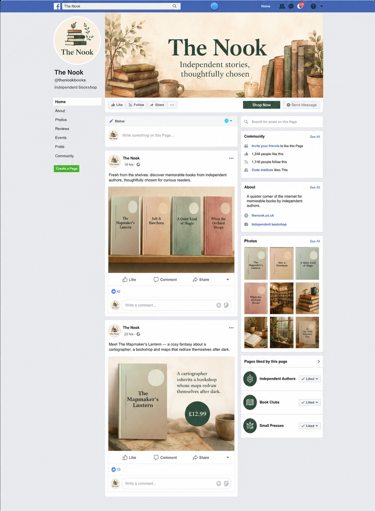

As the site owner does not have a personal Facebook account, a mock-up of a potential Facebook Business page was created that could support the social media marketing aspects of the business plan. It retains the theme of the main site, but would feature the ability to post short-form content to drive engagement with customers.

### Author-Led Promotion

Independent authors also provide a potential source of organic promotion.

Because each approved author receives a public profile and their books receive dedicated product pages, authors can share links to their own listings with existing readers and followers.

This creates a mutually beneficial relationship: authors gain additional exposure while The Nook receives traffic from the audiences those authors have already developed.

### Customer Retention

The marketing strategy is not focused solely on acquiring new visitors.

The application also includes features intended to encourage repeat engagement, including:

* Reader reviews.
* Order history.
* Newsletter subscriptions.
* Featured and new books.
* Author profile pages.
* Search and genre-based catalogue discovery.

As additional books and authors are added, these features provide customers with reasons to return to the site rather than treating each purchase as an isolated transaction.

### Future Marketing Opportunities

If The Nook were developed beyond the submitted MVP, the marketing strategy could be expanded through:

* Automated Mailchimp campaigns for new releases.
* Genre-specific newsletter segments.
* Promotional discount codes.
* Social-media advertising.
* Author interviews and editorial content.
* Referral campaigns.
* Abandoned-basket email reminders.
* Analytics to identify the highest-converting acquisition channels.

For the submitted project, the combination of SEO, Mailchimp integration, social-media presence and a clearly defined independent-book niche provides the foundation for a realistic digital marketing strategy.

---

## Data Model

The Nook uses a relational database to support authentication, reader accounts, author profiles, book listings, reviews, orders and newsletter subscriptions.

SQLite is used during local development, while the deployed Heroku application uses PostgreSQL. Django's ORM is used to define and manage the data model, allowing the same model structure to be used across both environments.

The application uses Django's built-in `User` model alongside several custom models distributed across the project's reusable Django applications.

### Entity Relationship Diagram

The following Entity Relationship Diagram shows the primary database models and relationships used by The Nook:

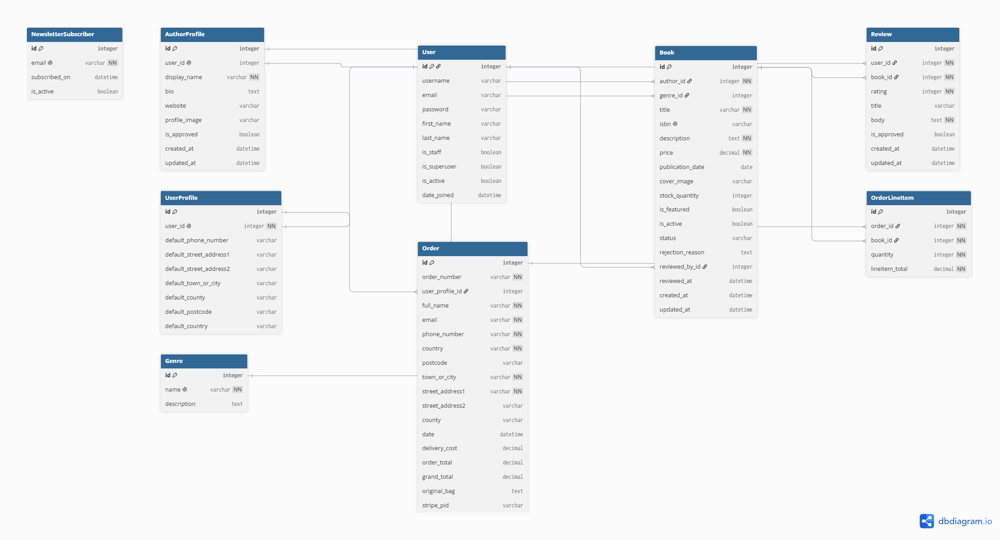

### Data Model Overview

| Model                | App                   | Purpose                                                                                              |
| -------------------- | --------------------- | ---------------------------------------------------------------------------------------------------- |
| User                 | Django Authentication | Provides account registration, authentication and user identity.                                     |
| UserProfile          | Profiles              | Stores default delivery information for registered customers and links users to their order history. |
| AuthorProfile        | Authors               | Stores public author information and optionally links an author to a registered user account.        |
| Genre                | Books                 | Stores the categories used to organise books within the catalogue.                                   |
| Book                 | Books                 | Stores books available through The Nook, including pricing, stock and approval information.          |
| Review               | Books                 | Stores reader ratings and written reviews linked to users and books.                                 |
| Order                | Checkout              | Stores customer, delivery, payment reference and calculated order-total information.                 |
| OrderLineItem        | Checkout              | Stores each individual book and quantity contained within an order.                                  |
| NewsletterSubscriber | Newsletter            | Stores newsletter subscriber email addresses and subscription status.                                |

### Model Relationships

| Relationship          | Type                              | Description                                                                                                  |
| --------------------- | --------------------------------- | ------------------------------------------------------------------------------------------------------------ |
| User → UserProfile    | One-to-one                        | Each registered user has one customer profile containing their default delivery information.                 |
| User → AuthorProfile  | One-to-one, optional              | A registered user can have one author profile. Author profiles may also exist without a linked user account. |
| AuthorProfile → Book  | One-to-many                       | One author can have multiple books listed on The Nook.                                                       |
| Genre → Book          | One-to-many                       | One genre can contain multiple books. A book can belong to one genre.                                        |
| User → Review         | One-to-many                       | A registered user can create multiple reviews.                                                               |
| Book → Review         | One-to-many                       | A book can receive multiple reader reviews.                                                                  |
| UserProfile → Order   | One-to-many                       | A registered customer's profile can be associated with multiple orders.                                      |
| Order → OrderLineItem | One-to-many                       | An order can contain multiple line items.                                                                    |
| Book → OrderLineItem  | One-to-many                       | A book can appear in multiple order line items across different orders.                                      |
| User → Book           | One-to-many through `reviewed_by` | Staff users can be recorded as the reviewer responsible for approving or rejecting book submissions.         |

### User

The application uses Django's built-in `User` model rather than implementing a custom authentication model.

The `User` model provides:

* Username and password authentication.
* Email addresses.
* Staff and superuser permissions.
* Relationships to customer profiles.
* Relationships to author profiles.
* Ownership of reader reviews.
* Staff ownership of book approval decisions.

Authentication and password management are therefore handled using Django's established authentication framework rather than duplicating this functionality in a custom model.

### UserProfile

`UserProfile` extends the information stored against a registered customer.

Each `UserProfile` has a one-to-one relationship with Django's `User` model.

It stores default delivery information including:

* Phone number.
* Street addresses.
* Town or city.
* County.
* Postcode.
* Country.

A profile is automatically created when a new Django user is created.

The profile is also used to associate authenticated customers with their previous orders, allowing the account page to display order history.

### AuthorProfile

`AuthorProfile` represents an independent author whose work can be listed through The Nook.

The model contains:

* Display name.
* Biography.
* Website.
* Profile image.
* Approval status.
* Created and updated timestamps.

An author profile can optionally have a one-to-one relationship with a registered Django user.

Allowing the user field to be optional also supports demonstration and curated catalogue records that are not managed by an active author account.

One author can be linked to multiple books.

### Genre

`Genre` provides controlled catalogue categories.

The model contains:

* Unique genre name.
* Optional description.

A genre can be linked to multiple books, while each book can have a maximum of one genre.

The relationship is optional so that removing a genre does not require the associated book record to be deleted.

### Book

`Book` is one of the central models within the application.

It stores:

* Author.
* Genre.
* Title.
* ISBN.
* Description.
* Price.
* Publication date.
* Cover image.
* Available stock.
* Featured status.
* Active status.
* Approval status.
* Rejection reason.
* Reviewing staff member.
* Review date and time.
* Created and updated timestamps.

The model supports the author-submission and staff-approval workflow through four status values:

* `draft`
* `pending`
* `approved`
* `rejected`

The relationship to `AuthorProfile` uses `PROTECT`, preventing an author from being deleted while books still depend on that record.

The optional genre relationship uses `SET_NULL`, allowing a genre to be removed without deleting the book.

The optional `reviewed_by` relationship links a book to the staff user who most recently reviewed its submission.

### Review

`Review` stores reader feedback against books.

Each review belongs to:

* One registered user.
* One book.

The model stores:

* Rating from 1 to 5.
* Optional review title.
* Review body.
* Approval status.
* Created and updated timestamps.

Django validators restrict ratings to values between 1 and 5.

A database uniqueness constraint prevents the same user from creating more than one review for the same book. A user can therefore review multiple different books, and a book can receive reviews from multiple different users.

Deleting a user or book also removes the associated reviews because both relationships use cascading deletion.

### Order

`Order` stores the information associated with a completed checkout.

It contains:

* Unique generated order number.
* Optional customer profile.
* Customer name and email.
* Phone number.
* Delivery address.
* Order date.
* Delivery charge.
* Order subtotal.
* Grand total.
* Original basket contents.
* Stripe Payment Intent identifier.

An order can optionally be linked to a registered `UserProfile`. This allows both authenticated and guest-style checkout data to be retained while enabling registered users to see their previous orders.

Order numbers are automatically generated using UUID values.

Order totals are calculated from the associated line items. Delivery charges are then calculated according to the configured free-delivery threshold and delivery percentage.

### OrderLineItem

`OrderLineItem` represents an individual book within an order.

Each line item contains:

* Parent order.
* Book.
* Quantity.
* Calculated line-item total.

One order can contain multiple line items.

A book can also appear within multiple line items belonging to different orders.

The book relationship uses `PROTECT`. This prevents a book record that forms part of an existing order history from being deleted and breaking historical transaction information.

The line-item total is calculated automatically from:

`book price × quantity`

### NewsletterSubscriber

`NewsletterSubscriber` stores local records of users who subscribe to The Nook newsletter.

The model contains:

* Unique email address.
* Subscription date.
* Active status.

The application also sends subscriber information to the configured Mailchimp audience. The local model therefore provides an application-side record while Mailchimp provides the marketing mailing-list functionality.

### Data Integrity

Several database and Django model features are used to protect data integrity:

* Unique ISBN values prevent duplicate book identifiers.
* Genre names are unique.
* Newsletter subscriber email addresses are unique.
* A database constraint prevents a user from reviewing the same book more than once.
* Review ratings are restricted to values between 1 and 5.
* `PROTECT` is used where deleting a related record would damage important catalogue or order-history data.
* `CASCADE` is used for records such as reviews that should be removed when their parent record is removed.
* `SET_NULL` is used for optional relationships where the related record can safely continue to exist independently.
* Django forms provide additional validation before data reaches the database.

---

## Deployment

The Nook is deployed to Heroku and uses PostgreSQL as its production database. Static files are served using WhiteNoise, uploaded media is stored using Cloudinary, payments are processed through Stripe and newsletter subscriptions are integrated with Mailchimp.

The deployed application can be accessed at:

[The Nook – Live Site](https://project-5-the-nook-bookshop-26884e3af76e.herokuapp.com/)

### Local Preparation

Before deployment, the project was prepared for a production environment.

The required production packages were installed:

```bash
pip install gunicorn dj-database-url psycopg2-binary
```

The `requirements.txt` file was then updated:

```bash
pip freeze > requirements.txt
```

A `Procfile` was created in the project root containing:

```text
release: python manage.py migrate --no-input
web: gunicorn the_nook.wsgi
```

The `release` process ensures that outstanding Django migrations are applied whenever a new release is deployed.

The `web` process starts the Django application using Gunicorn.

### Database Configuration

SQLite is used during local development, while the deployed application uses PostgreSQL.

The database configuration checks for the `DATABASE_URL` environment variable supplied by Heroku. When this variable is available, Django connects to the production PostgreSQL database. Otherwise, the application falls back to the local SQLite database.

This allows the database configuration to change between local and production environments without storing production credentials in the codebase.

### Security and Environment Variables

Sensitive configuration values are stored as environment variables and are not committed to GitHub.

The local `env.py` file is included in `.gitignore`.

The production application uses Heroku Config Vars for sensitive values.

The following Config Vars were configured:

| Variable                  | Purpose                                           |
| ------------------------- | ------------------------------------------------- |
| `DATABASE_URL`            | PostgreSQL database connection provided by Heroku |
| `SECRET_KEY`              | Django secret key                                 |
| `STRIPE_PUBLIC_KEY`       | Stripe public API key                             |
| `STRIPE_SECRET_KEY`       | Stripe secret API key                             |
| `STRIPE_WH_SECRET`        | Stripe webhook signing secret                     |
| `CLOUDINARY_URL`          | Cloudinary media-storage credentials              |
| `MAILCHIMP_API_KEY`       | Mailchimp API authentication                      |
| `MAILCHIMP_SERVER_PREFIX` | Mailchimp account server prefix                   |
| `MAILCHIMP_AUDIENCE_ID`   | Mailchimp newsletter audience                     |

`DEBUG` is set to `False` in the deployed application.

The Heroku application hostname is also included within Django's `ALLOWED_HOSTS` configuration.

### Heroku Deployment

The project was deployed using the following process:

1. Create a new application in the Heroku Dashboard.

2. Select the Europe region.

3. Add a Heroku Postgres database to the application.

4. Open the application's Settings and add the required Config Vars.

5. Connect the Heroku application to the project's GitHub repository.

6. Select the `main` branch for deployment.

7. Deploy the branch through the Heroku Dashboard.

8. Heroku installs the packages defined in `requirements.txt`.

9. The release process runs:

   ```bash
   python manage.py migrate --no-input
   ```

10. Gunicorn starts the Django application using:

```text
web: gunicorn the_nook.wsgi
```

11. Once deployment completes, the application can be opened through the Heroku Dashboard.

### Production Database Setup

The first deployment created the production PostgreSQL database and applied all application migrations.

A production administrator account was then created by opening a Heroku console and running:

```bash
python manage.py createsuperuser
```

The Django administration interface was then tested using the deployed application.

Test catalogue data was added and checked through the live site to confirm that database-backed content operated correctly in production.

### Cloudinary

Uploaded media is stored using Cloudinary rather than the temporary Heroku filesystem.

A test book with an uploaded cover image was created in the production application. The image was successfully displayed in the live catalogue and book detail page, confirming that production media storage was operating correctly.

### Stripe Configuration

Stripe test credentials are stored using Heroku Config Vars.

A separate webhook endpoint was created in Stripe for the deployed application:

```text
https://project-5-the-nook-bookshop-26884e3af76e.herokuapp.com/checkout/wh/
```

The webhook signing secret generated for this endpoint was stored as the `STRIPE_WH_SECRET` Heroku Config Var.

The production checkout was tested using Stripe's test environment.

The following were verified:

* A book could be added to the basket.
* The checkout form could be completed.
* Stripe accepted the test payment.
* The customer was redirected to the order confirmation page.
* A successful purchase message was displayed.
* The basket was cleared following the purchase.
* The resulting order was saved in the production PostgreSQL database.
* The payment appeared successfully in the Stripe test dashboard.
* Stripe webhook requests returned successful responses.

### Django Sites and SEO

Django's Sites framework was updated after deployment so that the production domain is:

```text
project-5-the-nook-bookshop-26884e3af76e.herokuapp.com
```

This ensures that URLs generated within `sitemap.xml` use the deployed application rather than the default `example.com` domain.

The deployed versions of the following were tested:

* `/sitemap.xml`
* `/robots.txt`
* Custom 404 handling

The sitemap contains URLs using the production domain and the `robots.txt` file references the production sitemap.

### Mailchimp

The Mailchimp API credentials and audience information are stored as Heroku Config Vars.

Newsletter registration was tested from the deployed application.

A test subscription successfully:

* Submitted through the newsletter form.
* Connected to the configured Mailchimp audience.
* Produced the expected subscriber email.
* Displayed successful feedback to the user.

### Production Testing

Following deployment, the live application was compared with the local development version.

The following functionality was manually tested on Heroku:

* Homepage and navigation.
* User registration.
* User login and logout.
* Django administration login.
* Reader account functionality.
* Public book catalogue.
* Book search and filtering.
* Book detail pages.
* Author profiles.
* Author listing creation.
* Staff listing approval.
* Cloudinary-hosted book cover images.
* Basket functionality.
* Stripe checkout.
* Order confirmation.
* Stripe webhooks.
* Production order creation.
* Newsletter signup and Mailchimp integration.
* `sitemap.xml`.
* `robots.txt`.
* Custom 404 page.
* Responsive navigation and layouts.

The production application was found to match the expected functionality of the development version.

---

## Security

The final deployed version of the site uses the following security features:

 - `SECRET_KEY` is not hardcoded in the repository. It is stored in `env.py` which is included in `.gitignore` so that the key is not pushed to the repository.
 - `DEBUG` is set to `False` in `settings.py`
 - User data is protected using Django's built-in authentication.
 - Sensitive pages are protected using `@login_required`

---

## UX Design

The user experience for The Nook was designed around three connected journeys:

- Readers discovering and purchasing independent books.
- Authors creating profiles and submitting books.
- Staff reviewing submissions before they enter the public catalogue.

The design aims to make The Nook feel calm, trustworthy and easy to navigate while still giving it a recognisable independent-bookshop identity.

### UI Design

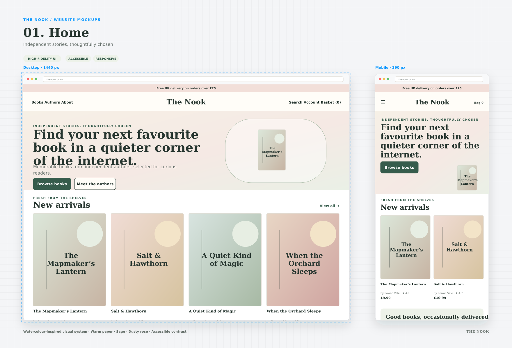

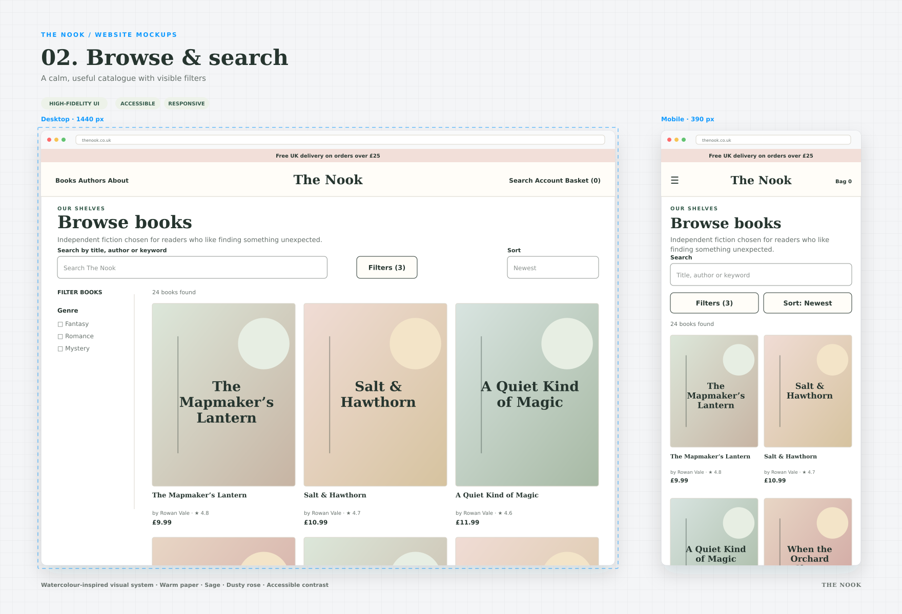

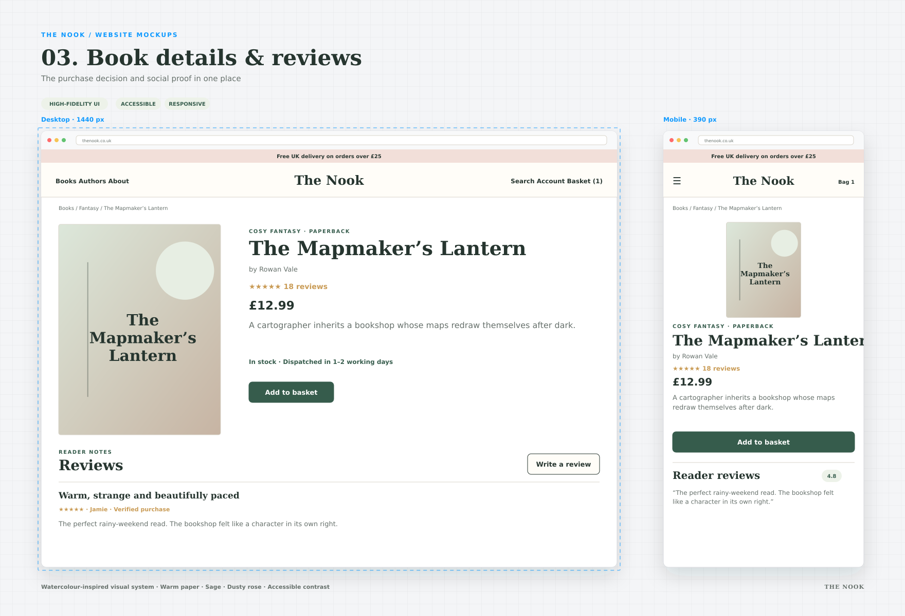

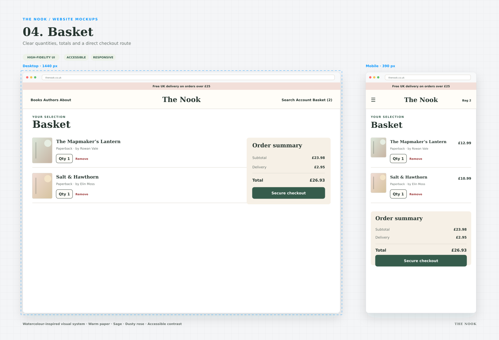

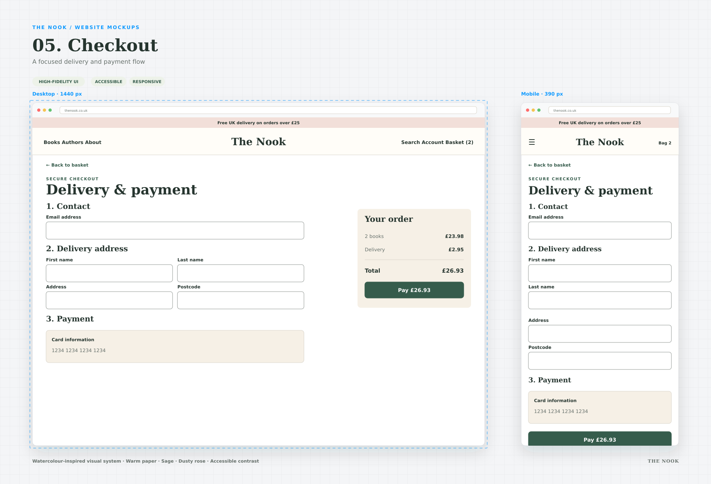

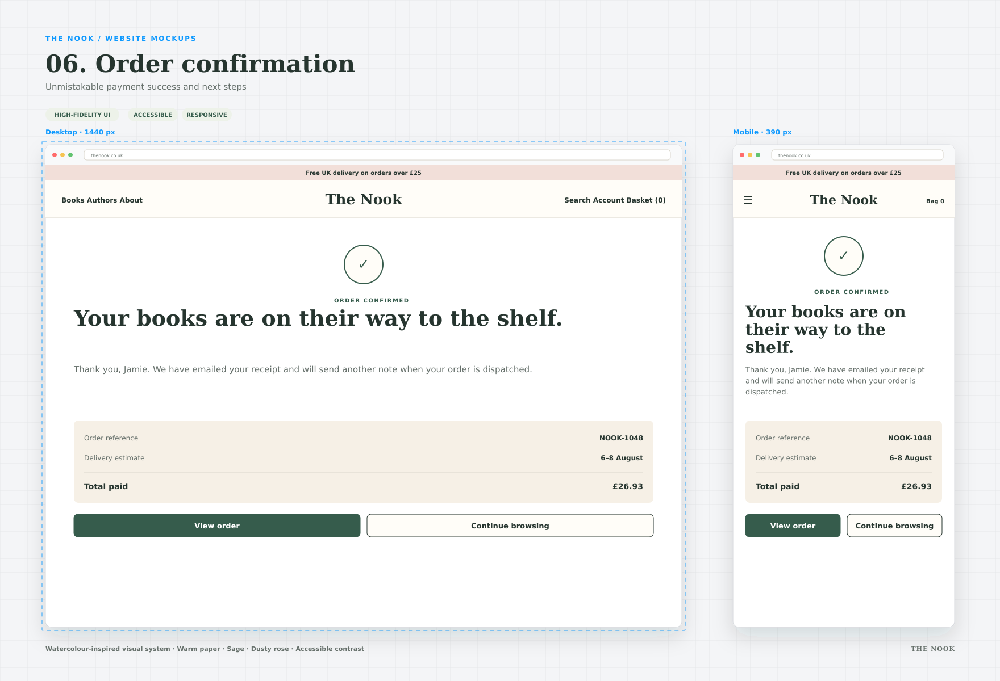

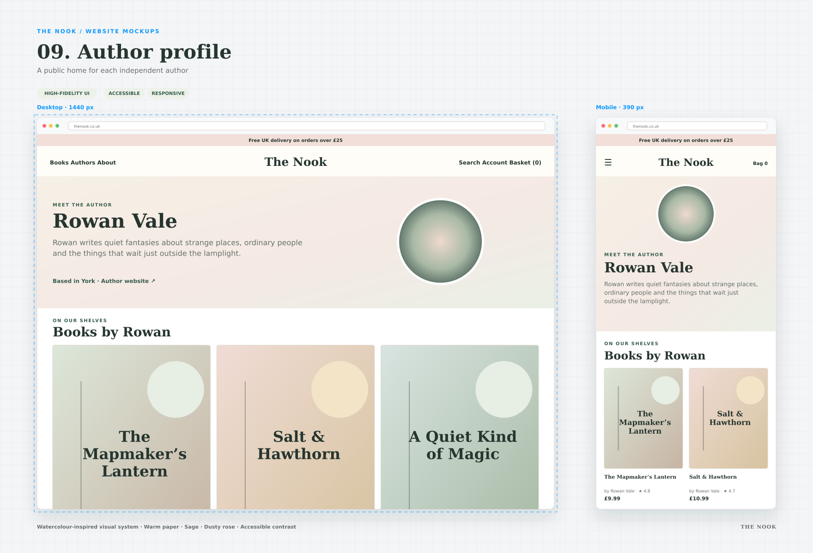

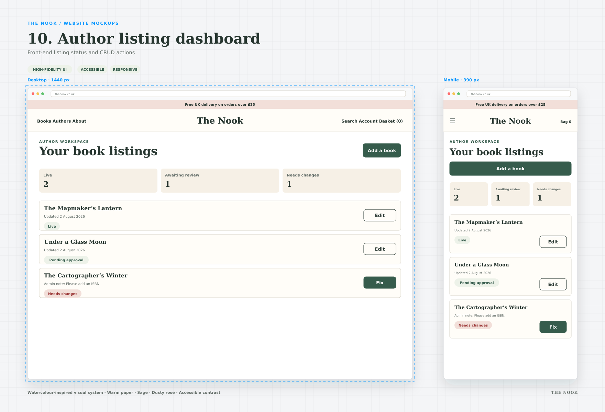

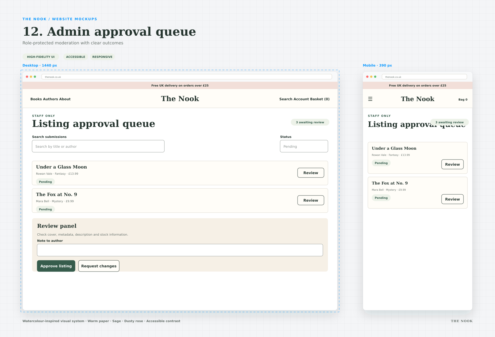

### UX Strategy

The main UX goals were to:

- Make the purpose of the application immediately clear to new visitors.
- Allow readers to move from discovery to purchase with as little friction as possible.
- Present important purchasing information before asking users to add a book to their basket.
- Give authors a clear view of their submitted books and their approval status.
- Separate reader, author and staff functionality without making the main navigation overly complicated.
- Provide clear feedback after important actions such as updating a basket, submitting a listing or completing an order.
- Maintain a consistent experience across desktop and mobile devices.
- Support keyboard navigation, screen readers and users who require clearly visible focus states.

### User Needs

| User | Need | Design Response |
|------|------|-----------------|
| Visitor | Understand what The Nook offers | The homepage opens with a clear description and a prominent Browse Books call to action. |
| Reader | Find books that interest them | The catalogue provides search, genre filters and sorting controls. |
| Reader | Make an informed purchase | Book pages prioritise the cover, author, description, rating, price and stock information. |
| Customer | Complete a purchase confidently | The basket and checkout designs retain a visible order summary and provide clear confirmation after payment. |
| Registered user | Review previous activity | The account area groups personal details, reviews and order history in one location. |
| Author | Present themselves professionally | Authors can create a public profile containing their name, biography and published books. |
| Author | Understand the status of submitted books | The author dashboard displays each listing and its current approval status. |
| Staff member | Review submissions efficiently | The approval queue groups pending books and provides clear approval or change-request actions. |

### Primary User Journeys

| Journey | Intended Route |
|---------|----------------|
| Discover and purchase a book | Home → Catalogue → Book Details → Basket → Checkout → Order Confirmation |
| Manage a reader account | Sign In → Account → Order History or Reviews |
| Submit a book | Register or Sign In → Author Profile → Author Dashboard → Add Listing → Submit for Approval |
| Review a submission | Staff Sign In → Approval Queue → Review Listing → Approve or Request Changes |

### Information Architecture

The main navigation was kept deliberately concise. It provides access to Home, Books, Genres, New Releases and the Newsletter, while search, account and basket actions remain visible in the header.

Account-specific actions are grouped within the account menu. The options shown change depending on whether the user is logged out, logged in, an author or a staff member. This reduces clutter and prevents users from being offered actions they cannot access.

On smaller screens, the navigation collapses into a mobile menu. Search and basket access remain available without requiring users to navigate through multiple pages.

### Wireframes and High-Fidelity Mock-ups

Responsive mock-ups were created in Figma for desktop screens at 1440 pixels and mobile screens at 390 pixels. These were used to plan information hierarchy, page structure, responsive behaviour and the visual relationship between the reader, author and staff journeys.

#### Homepage

The homepage was designed to explain the purpose of The Nook immediately. Its primary call to action directs readers to the catalogue, while supporting content introduces the independent-author focus of the shop.
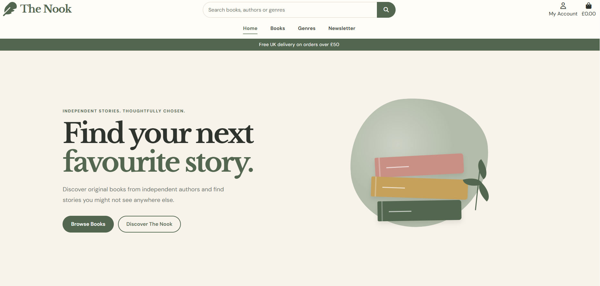

#### Book List

The book list combines search, genre filtering and sorting without hiding the books beneath excessive controls. Filters remain visible in a desktop sidebar but collapse behind a button on smaller screens.

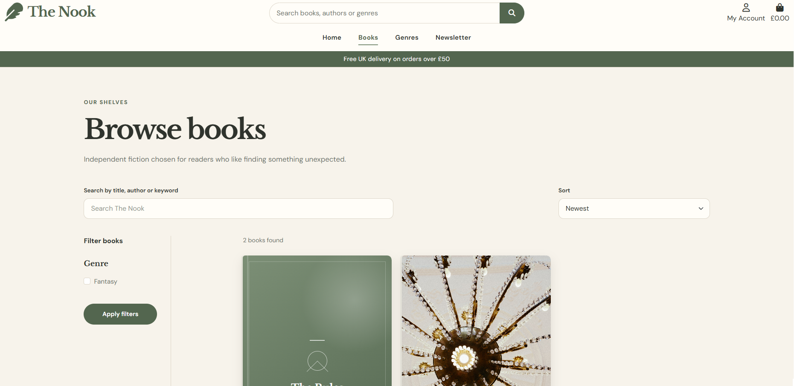

#### Book Details

The book detail page places the information needed for a purchasing decision near the top of the page. The cover, title, author, rating, price, description, stock status and basket action are grouped together. Reader reviews appear beneath the main product information as supporting social proof.

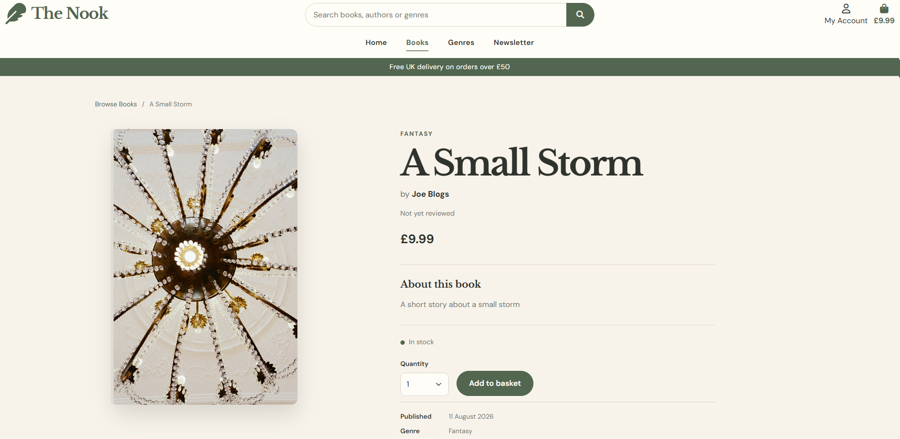

#### Checkout

The checkout was designed as a focused process with delivery and payment fields presented alongside a persistent order summary. On mobile devices, the sections stack into a single column while retaining the same information.

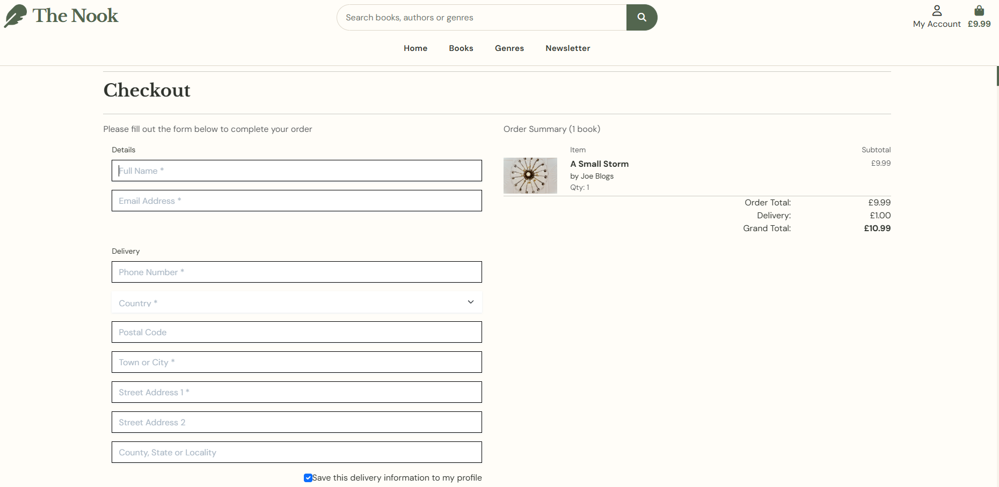

#### Author Dashboard

The author dashboard provides a summary of the author's listings and their current status. The add, edit and submission actions are kept close to the relevant book so that authors can manage their work without using the Django administration interface.

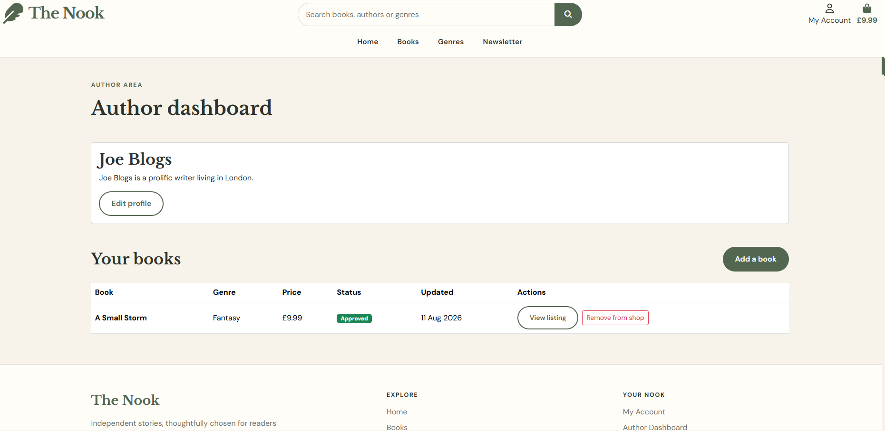

#### Book Approval

The approval queue separates staff moderation from the public catalogue. Pending submissions are presented with their status and a clear review action. Approval and change-request actions are only available to authorised staff members.

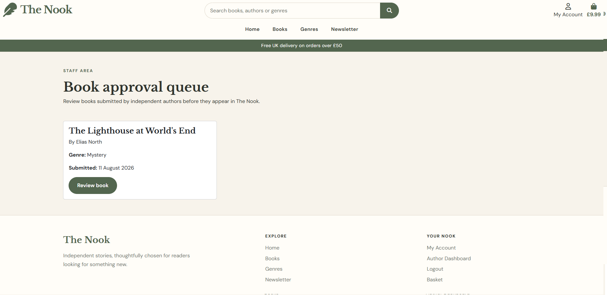

### Visual Design

The visual design is intended to suggest a quiet independent bookshop without reducing readability or making the interface feel old-fashioned. The palette uses warm paper tones, muted sage green, dusty rose and gold accents.

Decorative elements are restrained so that book information, forms and calls to action remain the focus of each page.

#### Colour Palette

| Colour | Hex Value | Use |
|--------|-----------|-----|
| Cream | `#f7f3eb` | Main page background |
| Paper | `#fffdf8` | Headers, cards and content surfaces |
| Sage | `#7c8f76` | Secondary accents and hover states |
| Dark Sage | `#53664f` | Primary buttons, links and branding |
| Dusty Rose | `#c99186` | Decorative accents |
| Gold | `#c5a15b` | Ratings and keyboard focus indicators |
| Ink | `#2f332d` | Primary text |
| Muted Grey | `#6f746d` | Supporting text |
| Border | `#ddd6c9` | Dividers, fields and card borders |

### Typography

The Nook uses two typefaces:

- **Libre Baskerville** is used for the logo, headings and book-related titles. Its serif design supports the traditional bookshop identity.
- **DM Sans** is used for body text, navigation, buttons and forms. It remains clear at smaller sizes and provides contrast with the heading typeface.

Heading sizes use responsive CSS so that the information hierarchy remains clear without causing text to overflow on smaller screens.

### Responsive Design

The interface uses Bootstrap's responsive grid together with custom CSS media queries.

The principal responsive changes include:

- The desktop navigation changing to a collapsible mobile menu.
- Book grids reducing from three or four columns to two columns.
- Catalogue filters collapsing behind a mobile filter button.
- Book details changing from a side-by-side layout to a vertical layout.
- Basket summaries and checkout forms stacking into a single column.
- Author and staff dashboards replacing wide rows with vertically stacked cards.
- Buttons and form fields expanding where additional width improves touch accessibility.

---

## Agile Development

The Nook was planned and managed using an iterative Agile approach. GitHub Issues were used to divide the application into epics, user stories, acceptance criteria and individual development tasks.

This allowed the project to be developed in manageable sections while maintaining a clear connection between the application’s purpose, user needs and technical implementation.

### Github Project

The Epics, User Stories, and associated tasks were captured and managed in Github Projects:

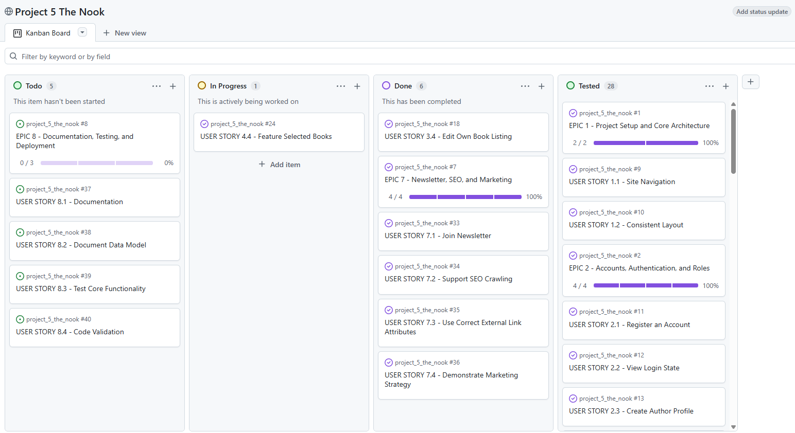

The Project Board can be found here:

[The Nook GitHub Project](https://github.com/users/gibba42/projects/5)

### Epics

The project requirements were divided into eight epics:

| Epic | Scope |
|------|-------|
| [Epic 1 – Project Setup and Core Architecture](https://github.com/gibba42/project_5_the_nook/issues/1) | Django setup, reusable templates, navigation, database configuration and static files |
| [Epic 2 – Accounts, Authentication and Roles](https://github.com/gibba42/project_5_the_nook/issues/2) | Registration, authentication, user profiles and role-based permissions |
| [Epic 3 – Book Catalogue and Author Listings](https://github.com/gibba42/project_5_the_nook/issues/3) | Public catalogue, book details, author profiles and listing management |
| [Epic 4 – Admin Approval](https://github.com/gibba42/project_5_the_nook/issues/4) | Staff review, approval and rejection of submitted books |
| [Epic 5 – Basket, Checkout and Purchasing](https://github.com/gibba42/project_5_the_nook/issues/5) | Basket management, Stripe payments, purchase feedback and order history |
| [Epic 6 – Reviews](https://github.com/gibba42/project_5_the_nook/issues/6) | Creating, editing, deleting and displaying reader reviews |
| [Epic 7 – Newsletter, SEO and Marketing](https://github.com/gibba42/project_5_the_nook/issues/7) | Newsletter registration, search-engine optimisation and marketing evidence |
| [Epic 8 – Documentation, Testing and Deployment](https://github.com/gibba42/project_5_the_nook/issues/8) | README documentation, testing, validation, security and deployment |

### User Stories

Each epic was divided into user stories written from the perspective of a visitor, reader, author, staff member, site owner or developer.

The following format was used:

> As a **type of user**, I want to **perform an action** so that I can **receive a particular benefit**.

Each user story also contains:

- Acceptance criteria written using Given, When and Then statements.
- A priority based on the importance of the requirement.
- A checklist of the development tasks required to complete the story.
- A GitHub Issue status showing whether the story remains open or has been completed.

### MoSCoW Prioritisation

MoSCoW prioritisation was used to decide which features were essential for the minimum viable product and which could be deferred.

| Priority | Description |
|----------|-------------|
| Must Have | Essential features required for the application to meet its core purpose. |
| Should Have | Useful features that would improve the application but were not essential for the MVP. |
| Could Have | Desirable stretch features that could be added if time allowed. |
| Won't Have This Time | Features intentionally deferred from the final submitted version. |

---

### Development Process

Development was completed incrementally. Each user story was broken into smaller tasks so that individual pieces of functionality could be implemented and tested before moving to the next requirement.

The general process was:

1. Select the next high-priority user story.
2. Review its acceptance criteria and task checklist.
3. Implement the required model, view, URL, template or supporting logic.
4. Test the functionality and permissions.
5. Resolve any bugs discovered during testing.
6. Update the task checklist and close the issue once its acceptance criteria had been met.

This process was also used when previously completed functionality required further work. For example, the navigation user story was revisited when the Genres link did not open the expected catalogue filters. The issue was only closed after the link behaviour and automated navigation tests had been corrected.

---

## Testing

Testing was completed throughout development using a combination of manual and automated testing.

Manual testing focused on complete user journeys, permissions, responsiveness, form validation, third-party integrations and the deployed application. Automated Django tests were used to repeatedly verify important models, views, URLs and navigation behaviour while changes were being made to the codebase.

The final deployed Heroku version was also manually tested to confirm that its behaviour matched the local development version.

### Manual Testing

Manual testing was carried out against the acceptance criteria defined in the project's GitHub user stories.

Testing covered the three main user roles within The Nook:

* Visitors and readers browsing and purchasing books.
* Authors creating profiles and managing book submissions.
* Staff reviewing and approving submitted listings.

It also covered functionality that depends on external services, including Stripe, Cloudinary and Mailchimp.

#### Navigation and Public Pages

| Test                                     | Expected Result                                                  | Actual Result | Status |
| ---------------------------------------- | ---------------------------------------------------------------- | ------------- | ------ |
| Open the homepage                        | The homepage loads successfully and clearly introduces The Nook  | As expected   | Pass   |
| Use each main navigation link            | Each link opens the correct page without an error                | As expected   | Pass   |
| Click the Books link                     | The public catalogue opens                                       | As expected   | Pass   |
| Use the Genres navigation option         | The catalogue opens with the genre filtering interface available | As expected   | Pass   |
| Use the site search                      | Relevant matching books are displayed                            | As expected   | Pass   |
| Search for a term with no matching books | A suitable empty-results response is displayed                   | As expected   | Pass   |
| Open a book from the catalogue           | The correct book detail page loads                               | As expected   | Pass   |
| Open an author from a book/listing       | The correct public author profile loads                          | As expected   | Pass   |
| Use the site on a narrow mobile viewport | Navigation and page content resize without horizontal overflow   | As expected   | Pass   |

#### Authentication and Account Management

| Test                                                       | Expected Result                                                         | Actual Result | Status |
| ---------------------------------------------------------- | ----------------------------------------------------------------------- | ------------- | ------ |
| Register with valid account details                        | A new user account is created successfully                              | As expected   | Pass   |
| Submit registration with invalid or incomplete data        | Validation prevents account creation and explains the problem           | As expected   | Pass   |
| Log in with valid credentials                              | The user is authenticated successfully                                  | As expected   | Pass   |
| Log in with incorrect credentials                          | Login is rejected and appropriate feedback is provided                  | As expected   | Pass   |
| Log out                                                    | The session ends and navigation reflects the logged-out state           | As expected   | Pass   |
| View the account menu while logged out                     | Only options appropriate to anonymous users are shown                   | As expected   | Pass   |
| View the account menu while logged in                      | Authenticated account options are shown                                 | As expected   | Pass   |
| Attempt to access protected functionality while logged out | Access is prevented or the user is redirected to sign in                | As expected   | Pass   |
| View the reader account page                               | User details, reviews and order information are displayed appropriately | As expected   | Pass   |

#### Book Catalogue and Author Listings

| Test                                  | Expected Result                                                                   | Actual Result | Status |
| ------------------------------------- | --------------------------------------------------------------------------------- | ------------- | ------ |
| Browse approved books                 | Only appropriate public catalogue listings are displayed                          | As expected   | Pass   |
| Search catalogue by title/keyword     | Matching books are displayed                                                      | As expected   | Pass   |
| Filter catalogue by genre             | Only relevant books are displayed                                                 | As expected   | Pass   |
| Change catalogue sorting              | Books are displayed in the selected order                                         | As expected   | Pass   |
| Open a book detail page               | Cover, title, author, description, price and purchasing information are displayed | As expected   | Pass   |
| Open a listing with an uploaded cover | The Cloudinary-hosted image loads correctly                                       | As expected   | Pass   |
| View an author profile                | The author's biography and relevant books are displayed                           | As expected   | Pass   |

#### Author Functionality

| Test                                          | Expected Result                                                      | Actual Result | Status |
| --------------------------------------------- | -------------------------------------------------------------------- | ------------- | ------ |
| Create an author profile                      | Profile data is saved and the author functionality becomes available | As expected   | Pass   |
| Open the author dashboard                     | The author's submitted books and their statuses are displayed        | As expected   | Pass   |
| Create a new book listing with valid data     | The listing is saved successfully                                    | As expected   | Pass   |
| Submit a listing with missing required fields | Validation prevents the invalid record from being created            | As expected   | Pass   |
| Edit an author's own listing                  | Changes are saved and immediately reflected in the interface         | As expected   | Pass   |
| Delete an author's own listing                | The listing is removed after the relevant delete action              | As expected   | Pass   |
| Attempt to manage another author's listing    | Access is denied                                                     | As expected   | Pass   |
| Submit a book for approval                    | The book moves into the appropriate pending state                    | As expected   | Pass   |

#### Staff Approval

| Test                                                            | Expected Result                                                                    | Actual Result | Status |
| --------------------------------------------------------------- | ---------------------------------------------------------------------------------- | ------------- | ------ |
| Open the approval area as a staff user                          | Pending submissions are available for review                                       | As expected   | Pass   |
| Attempt to access staff approval functionality as a normal user | Access is denied                                                                   | As expected   | Pass   |
| Approve a pending book                                          | Its approval status changes and the book becomes available in the public catalogue | As expected   | Pass   |
| Reject/request changes to a submission                          | The listing is not published and its status/reason is updated                      | As expected   | Pass   |
| Review the author's dashboard after moderation                  | The updated approval status is visible to the author                               | As expected   | Pass   |

#### Reviews

| Test                                         | Expected Result                                                  | Actual Result | Status |
| -------------------------------------------- | ---------------------------------------------------------------- | ------------- | ------ |
| Create a review while authenticated          | The review is saved and displayed against the relevant book      | As expected   | Pass   |
| Submit invalid review data                   | Validation prevents the invalid review from being saved          | As expected   | Pass   |
| Edit the user's own review                   | The updated content is immediately displayed                     | As expected   | Pass   |
| Delete the user's own review                 | The review is removed                                            | As expected   | Pass   |
| Attempt to edit/delete another user's review | Access is prevented                                              | As expected   | Pass   |
| View reviews while logged out                | Public reviews remain readable without exposing editing controls | As expected   | Pass   |

#### Basket

| Test                              | Expected Result                                               | Actual Result | Status |
| --------------------------------- | ------------------------------------------------------------- | ------------- | ------ |
| Add a book to the basket          | The selected book appears in the basket and feedback is shown | As expected   | Pass   |
| Add more than one book            | Basket totals update to include all items                     | As expected   | Pass   |
| Update item quantity              | Quantity and calculated totals update correctly               | As expected   | Pass   |
| Remove a book                     | The book is removed and appropriate removal feedback is shown | As expected   | Pass   |
| View basket on mobile             | Basket content remains usable without overflowing the screen  | As expected   | Pass   |
| Continue shopping from the basket | The user can return to the catalogue                          | As expected   | Pass   |

#### Checkout and Stripe

Stripe checkout was tested using Stripe's test environment rather than real payment card information.

| Test                                                          | Expected Result                                                | Actual Result | Status |
| ------------------------------------------------------------- | -------------------------------------------------------------- | ------------- | ------ |
| Open checkout with items in the basket                        | Delivery, payment and order summary information is displayed   | As expected   | Pass   |
| Submit checkout with missing required delivery details        | Validation prevents checkout and identifies the invalid fields | As expected   | Pass   |
| Complete payment using Stripe test card `4242 4242 4242 4242` | Stripe accepts the test payment                                | As expected   | Pass   |
| Complete a successful order                                   | The order confirmation page is displayed                       | As expected   | Pass   |
| Complete a successful order                                   | A success notification is displayed                            | As expected   | Pass   |
| Complete a successful order                                   | The basket is emptied                                          | As expected   | Pass   |
| Check Django administration after payment                     | The new order exists in the database                           | As expected   | Pass   |
| Check Stripe Dashboard after payment                          | The successful test payment appears in Stripe                  | As expected   | Pass   |
| Check Stripe webhook delivery                                 | The deployed webhook receives a successful response            | As expected   | Pass   |

#### Newsletter

| Test                                  | Expected Result                                              | Actual Result | Status |
| ------------------------------------- | ------------------------------------------------------------ | ------------- | ------ |
| Submit a valid email address          | Newsletter signup succeeds and user feedback is displayed    | As expected   | Pass   |
| Check Mailchimp after signup          | The subscriber is added to the configured Mailchimp audience | As expected   | Pass   |
| Check the supplied email address      | The expected Mailchimp email is received                     | As expected   | Pass   |
| Submit invalid newsletter information | Form validation prevents invalid submission                  | As expected   | Pass   |

#### SEO and Error Handling

| Test                                          | Expected Result                                                            | Actual Result | Status |
| --------------------------------------------- | -------------------------------------------------------------------------- | ------------- | ------ |
| Visit `/sitemap.xml`                          | A valid sitemap is returned                                                | As expected   | Pass   |
| Inspect sitemap URLs                          | URLs use the deployed Heroku domain rather than `example.com` or localhost | As expected   | Pass   |
| Visit `/robots.txt`                           | The robots file loads successfully                                         | As expected   | Pass   |
| Inspect the sitemap reference in `robots.txt` | It points to the production sitemap                                        | As expected   | Pass   |
| Navigate to a non-existent URL                | The custom The Nook 404 page is displayed                                  | As expected   | Pass   |
| Check page metadata                           | The application includes a site title and descriptive metadata             | As expected   | Pass   |

#### Production Deployment Testing

The final version was manually tested on Heroku after deployment.

The production application used a separate PostgreSQL database from the local SQLite development database, so the deployed environment was tested independently rather than assuming that successful local testing guaranteed successful production behaviour.

The following production-specific checks were completed:

| Test                                    | Expected Result                                                | Actual Result | Status |
| --------------------------------------- | -------------------------------------------------------------- | ------------- | ------ |
| Open deployed homepage                  | Application loads without a server or `DisallowedHost` error   | As expected   | Pass   |
| Run production database migrations      | All migrations apply successfully                              | As expected   | Pass   |
| Create production superuser             | Administrator can log into the deployed Django admin           | As expected   | Pass   |
| Create and display production book data | PostgreSQL records are available through the live interface    | As expected   | Pass   |
| Upload a book image                     | Image is stored and served successfully through Cloudinary     | As expected   | Pass   |
| Submit and approve an author listing    | Approval workflow operates correctly against PostgreSQL        | As expected   | Pass   |
| Complete Stripe test checkout           | Payment and order workflow operates successfully in production | As expected   | Pass   |
| Receive Stripe webhook                  | Production endpoint handles the Stripe webhook successfully    | As expected   | Pass   |
| Subscribe to newsletter                 | Live application communicates successfully with Mailchimp      | As expected   | Pass   |
| Open sitemap and robots files           | Both use the correct production domain                         | As expected   | Pass   |
| Request an invalid URL                  | Custom production 404 page is displayed with `DEBUG=False`     | As expected   | Pass   |

The deployed application was found to match the expected behaviour of the local development version.

### Automated Testing

Automated testing was implemented using Django's built-in testing framework.

Tests were run from the project root using:

```bash id="3hc4mg"
python manage.py test
```

Django creates a separate test database when the test suite runs. This allows models, database behaviour, views and permissions to be tested without altering normal development or production data.

Automated tests were added during development to protect important functionality as the application changed. These were particularly useful when changes to URLs, models, authentication and navigation introduced regressions.

The automated tests include checks relating to areas such as:

* Model creation and expected field behaviour.
* Public page responses.
* Navigation URLs.
* Catalogue and book functionality.
* Authentication-dependent views.
* Role-based access restrictions.
* Author functionality.
* Reviews and other database-backed functionality.

Automated tests were rerun following relevant fixes rather than being used only at the end of development.

For example, automated navigation tests helped identify and verify the fix to the Genres navigation behaviour, while model testing exposed an incomplete migration state during development. Both issues were corrected before the relevant functionality was considered complete.

#### Running the Tests

The complete suite can be run with:

```bash id="6g7mmf"
python manage.py test
```

More detailed output can be displayed with:

```bash id="wozi22"
python manage.py test --verbosity=2
```

Individual Django apps can also be tested separately during debugging, for example:

```bash id="1n6v6m"
python manage.py test books
```

This was useful when working on a specific component without needing to repeatedly investigate unrelated areas of the application.

#### Automated Test Approach

The automated test approach concentrated on behaviour that benefits from repeatable regression testing.

For model tests, test objects are created in Django's temporary test database and their expected values and relationships are checked.

For view and URL tests, Django's test client is used to make requests to application URLs. Responses can then be checked for expected status codes, redirects, templates and permission behaviour.

Authentication tests use test users with different roles where required so that restricted functionality can be verified against the application's authorisation rules.

This automated testing complements rather than replaces manual testing. Features involving visual responsiveness, complete checkout journeys, uploaded media and external services such as Stripe, Cloudinary and Mailchimp were also tested manually because their correct operation depends on behaviour outside a single Django unit test.

### Testing During Development

Testing was iterative rather than being postponed until project completion.

The general process was:

1. Implement a user story or individual task.
2. Run relevant automated tests.
3. Manually test the feature against its acceptance criteria.
4. Test invalid inputs and restricted access where applicable.
5. Fix identified problems.
6. Rerun affected automated tests.
7. Repeat the manual acceptance test.
8. Close the relevant GitHub task or user story only after the required behaviour was working.

Bugs identified during this process are documented separately in the [Bugs](#bugs) section.

This combination of automated regression testing, user-story-based manual testing and final production testing was used to verify functionality, usability, responsiveness and data management across the application.

---

## Validation

### W3C HTML Validation Results

The live Heroku site was used for this test. The test passed with no errors or warnings:

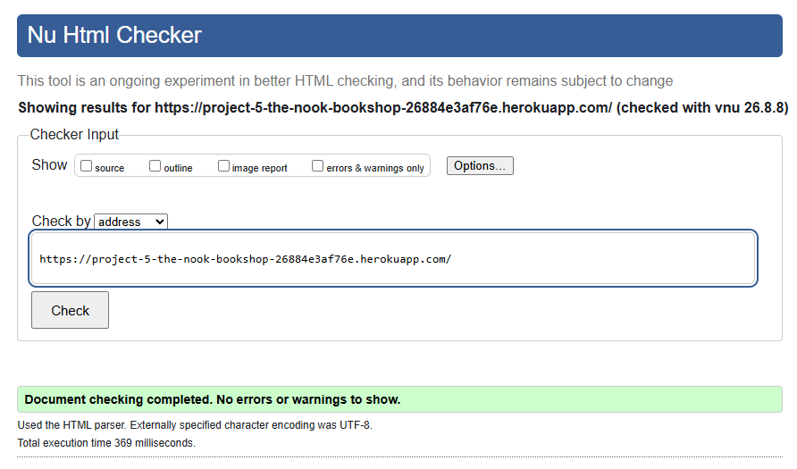

### W3C Jigsaw Validation Results

The live Heroku site was used for this test. The test passed with no errors or warnings:

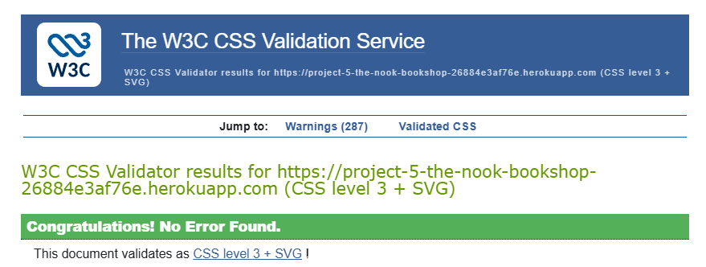

### Pycodestyle Results

The final version of the code was tested against PEP8 using the pycodestyle command:

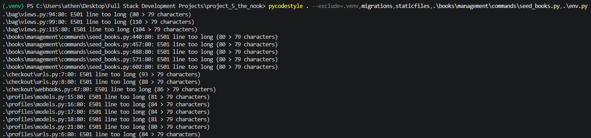

The shown flagged issues are considered acceptable. They all relate to lines being over 79 characters. In most cases they are only slightly over, or they are the default settings.py values.

### JSHint results

Minimal JavaScript was used for this project, the main functionality is handled through Django and Python. Javascript was used to improve the appearance of message notifications. This was tested using JSHint:

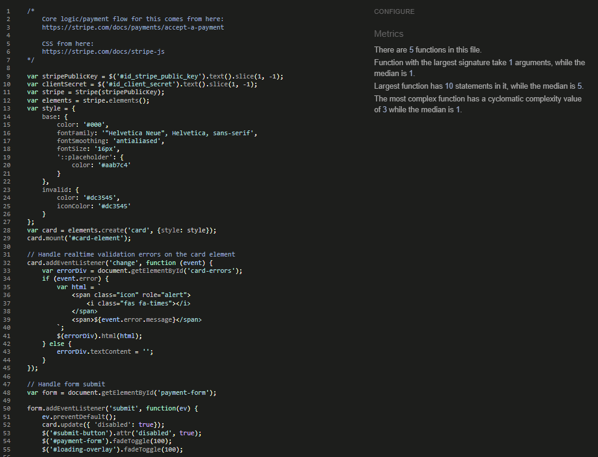

### Responsiveness Tests

The live Heroku site was tested for mobile responsiveness using Google development tools. The site was tested to a width of 300px, which was considered the lowest screen size a user would reasonably use:


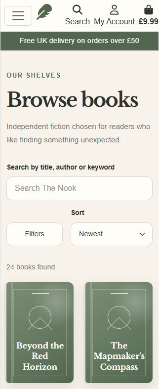

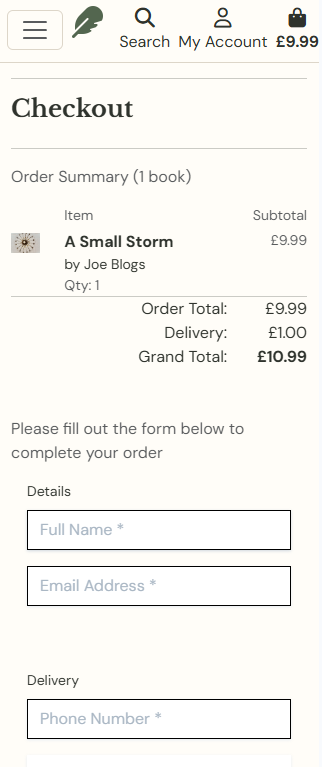

As shown above, elements scale appropriately at different resolutions.

---

## Bugs

| Title | Description | Fix | Status |
|-------|-------------|-----|--------|
| Automated tests failing because migrations were incomplete | The test database did not match the current models, causing an automated model test to fail. | Generated and applied the outstanding migrations, then reran the test suite. | Resolved |
| Account pages not loading | Several registration and account pages failed because the custom Django Allauth templates were based on an older template structure and were stored in locations not expected by the installed version. | Replaced the outdated overrides with templates compatible with the installed Allauth version, moved them into the correct template directories and retested the account pages. | Resolved |
| Genre navigation link did not open the filters | The Genres navigation link loaded the catalogue but did not reveal the collapsed filter panel, particularly on mobile devices. | Added a `show_filters` query parameter, passed its state through the view and used it to open the filter panel and set the correct accessible navigation state. | Resolved |
| One navigation test was not discovered | Django reported 17 tests instead of the expected 18 because the genre navigation test had been placed outside the `NavigationTests` class. | Corrected the indentation so the method belonged to the test class. Django then discovered the additional test. | Resolved |
| Checkout template failed to load | The checkout page raised a template error because `crispy_forms_tags` was misspelled as `cripsy_forms_tags`. | Corrected the template tag library name. | Resolved |
| Stripe payment form did not initialise | `stripe_elements.js` was stored inside `checkout/static/checkout/css/js/`, while the checkout template expected it under `checkout/static/checkout/js/`. | Moved the JavaScript file to the correct static directory so Django could load it from the expected path. | Resolved |
| Users could access another customer's order history | The order-history view looked up orders using only the order number. A logged-in user could potentially enter another valid order number in the URL and view that order. | Protected the view with `login_required` and restricted the order lookup to orders belonging to the current user's profile. | Resolved |
| Basket quantities could not be updated or removed | Basket items were displayed, but the session did not update correctly when users changed quantities or removed products. | Added the adjust and remove views and URLs, connected the quantity forms and removal script, and updated the basket session after each action. | Resolved |
| Product sorting produced incorrect results | Catalogue sorting did not consistently handle product names, categories, direction or empty searches. | Added query handling with Django `Q` objects, case-insensitive name sorting, category mapping, direction handling and feedback for empty searches. | Resolved |
| Product image field did not work in add and edit forms | Images selected through the product-management forms were not rendered or processed correctly. | Added a custom clearable file-input widget, ensured uploaded files were passed through `request.FILES` and updated the add and edit templates. | Resolved |
| User profile table did not exist locally | Accessing the administration or profile pages raised `OperationalError: no such table: profiles_userprofile` after the profiles application was introduced. | Created the profiles migration and applied the outstanding migrations to the local database. | Resolved |
| Author dashboard link raised `NoReverseMatch` | The profile page attempted to reverse an `authors` namespace that had not been registered in the project URLs. | Updated the template links to use the registered `author_dashboard` URL name. | Resolved |

---

## Tutorials and guides used

### Django

This project uses the Django authentication system. This was implemented using the Django documentation:

[Using the Django authentication system](https://docs.djangoproject.com/en/6.0/topics/auth/default/)

To add css styling to the project, I followed this guide:

[How to manage static files in Django](https://docs.djangoproject.com/en/dev/howto/static-files/)
